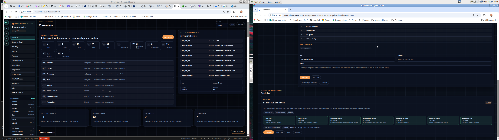
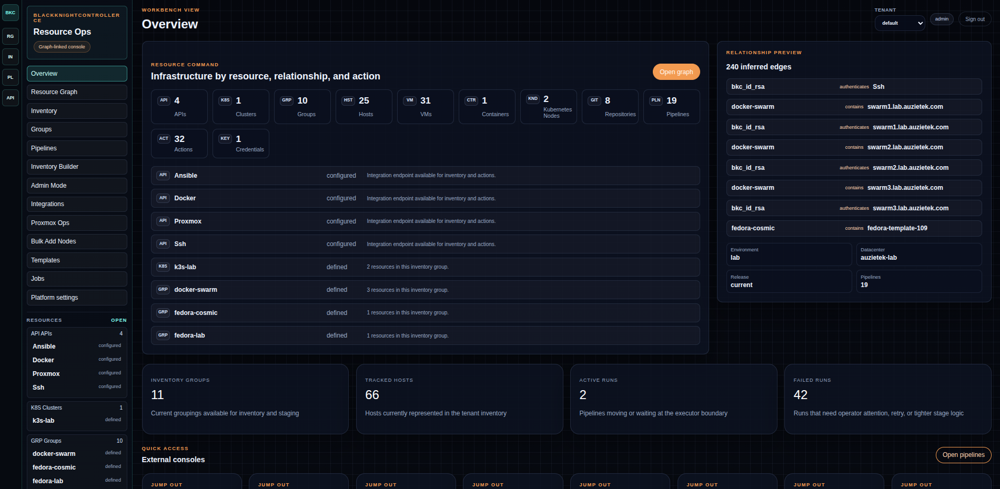
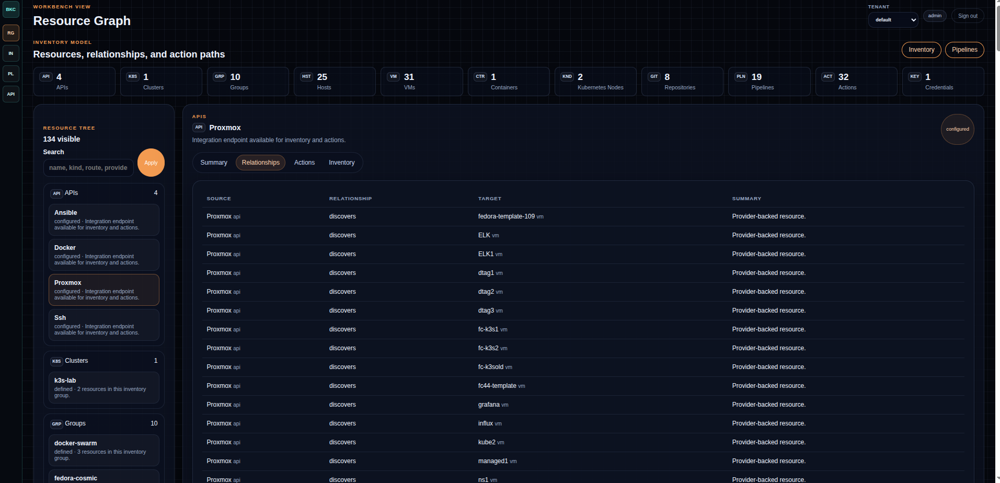
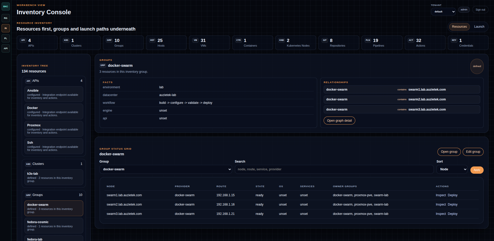
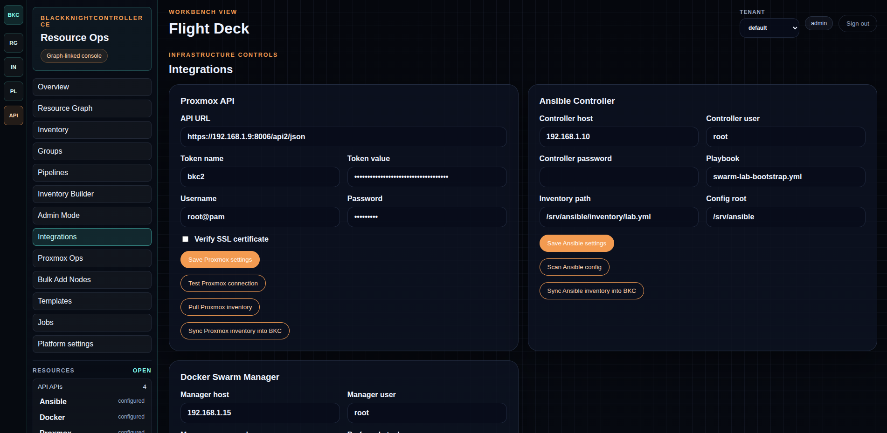
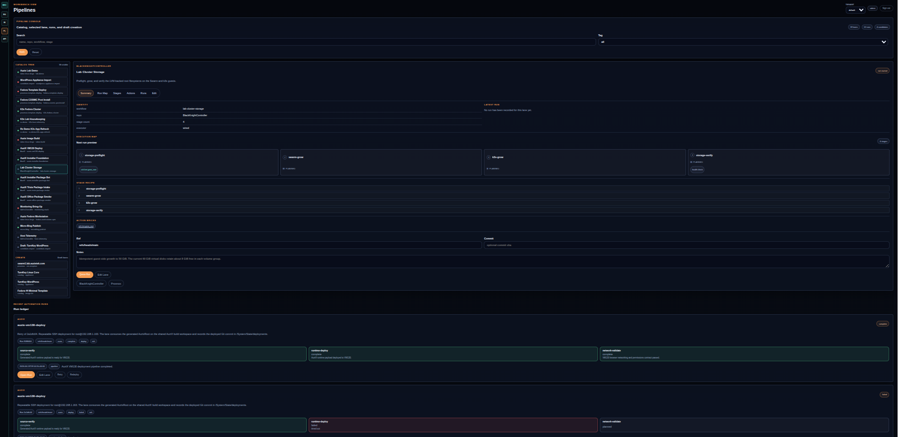
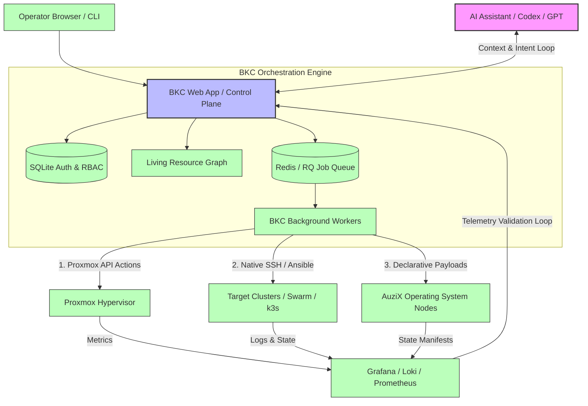
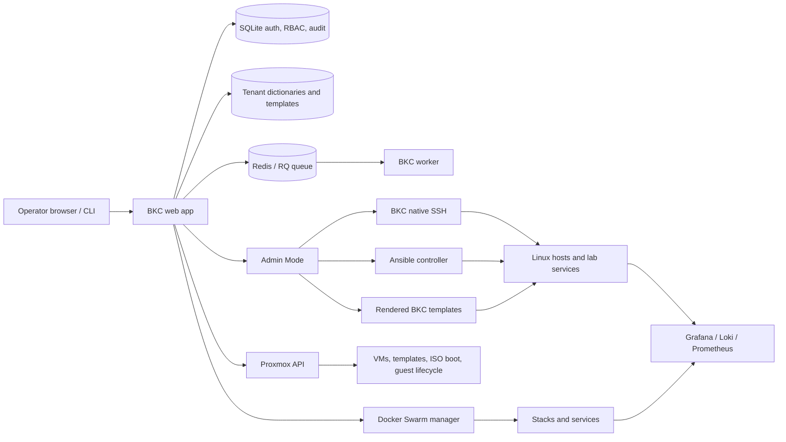

# Black Knight Controller

Black Knight Controller is a lightweight lab control plane for inventory,
integrations, and tracked automation pipelines. It started as a web interface
for a Fabric-style deployment system and has grown into a practical operator
surface for SSH, Ansible, Docker Swarm, Kubernetes, Proxmox, and custom build
lanes.



## Real-World Validation: Cluster Auto-Scale

A typical BKC story starts when a lab has several problems at once: a k3s
cluster and a Docker Swarm are low on storage, an AI service such as
`open-webui` is failing because guest CPUs are using generic virtualized
profiles, and the fix touches Proxmox, SSH, container APIs, and observability.

BKC turns that into a tracked run instead of a loose shell session:

1. Map the affected services, VMs, storage pools, and API endpoints through the
   resource graph.
2. Generate target-specific, idempotent SSH or Ansible remediation steps.
3. Use the Proxmox API for VM hardware changes such as CPU mode or storage
   adjustments.
4. Hand slower work to Redis/RQ workers so the UI remains usable.
5. Record stage state, validation output, and telemetry checks for the next
   run.

The point is repeatability: the first repair can be discovered interactively,
but the useful result becomes a pipeline that can be reviewed, rerun, and
improved.

## Visual Tour

BKC is intended for operators who are already comfortable with infrastructure
tools such as Docker, `kubectl`, SSH, Ansible, and hypervisor APIs. The UI keeps
those concepts visible instead of hiding them behind a wizard, which makes it a
good surface for an engineer and an AI sidecar to reason over the same state.



The overview page is the landing console: resource counts, inferred
relationships, active and failed run summaries, and jump points into the graph,
inventory, integrations, and pipelines.



The resource graph shows APIs, clusters, groups, hosts, VMs, containers,
repositories, pipelines, actions, and credentials as related resources. Pick a
resource to inspect its summary, relationships, available actions, or inventory
membership.



The inventory console keeps resources first and launch paths underneath. It is
where groups, host facts, relationships, status grids, and direct inspect/deploy
actions come together.



The integrations screen is the flight deck for Proxmox, Ansible, Docker Swarm,
SSH, and other API-backed inventory sources. Store credentials, test endpoints,
pull inventories, and sync discovered resources into BKC.



The pipelines screen turns manual fixes into tracked runs. Operators can browse
pipeline templates, inspect stages and action bricks, queue work, and review
recent run state without losing the underlying command/API model.

## System Architecture Mesh



The project started as a group-and-host deployment console. It now also acts as a lightweight lab control plane that can:

- manage tenant-scoped inventory
- scan and sync Ansible controllers
- scan and sync Docker Swarm state
- queue automation runs through Redis/RQ workers
- track pipelines for lab workflows such as monitoring bring-up and AuziX build/test loops
- stage toward Proxmox-driven VM lifecycle automation
- **learn new APIs and dynamically create orchestration stages**

In addition to the initial functionality, the Black Knight Controller also includes an "Add Nodes" routine. This allows users to add a list of hosts (IP or hostname) to a specific group. The system will test the credentials and save them, or perform a round of interactive steps to copy a preshared key to the destination.

We hope that the Black Knight Controller will help simplify lab operations and
make repeatable automation more approachable. The project is now public:
contributions, forks, experiments, and downstream lab-specific adaptations are
welcome.

## License

Black Knight Controller code is licensed under **GPL-3.0-or-later**.
Documentation, screenshots, diagrams, and other narrative or visual material are
licensed under **CC BY-SA 4.0** unless a file says otherwise. See `LICENSE` and
`LICENSES/`.

## Current lab direction

The current working model is:

- **BKC** as the orchestration and operator surface
- **Ansible / SSH** as one execution tier
- **Docker Swarm** as another execution tier
- **Proxmox** as the VM lifecycle tier
- **Grafana / Loki / Prometheus** as observability

The main user-facing term is now **pipeline**. Pipelines create tracked automation runs with stage state and event history. The older `workflow` term still exists in parts of the internal data model, but operators should think in terms of pipelines.

### System map



The practical split is:

- **Proxmox API** creates, clones, boots, and inventories VMs.
- **BKC SSH** handles direct host work without requiring operators to learn Ansible.
- **Ansible** remains useful for existing playbooks and inventories.
- **Pipelines** tie those pieces into tracked runs with stage history.

For the next UI pass, BKC should treat the left navigation as a **resource graph**, not a machine-only tree. Nodes can be VMs, hosts, Git repositories, API interfaces, storage pools, actions, templates, pipelines, or services. See `docs/ui-resource-graph.md` for the working information architecture.

The execution model should follow the same resource-first direction: pipelines are recipes of reusable actions, templates, target selectors, validations, and produced facts. See:

- `docs/pipeline-action-model.md` for the target pipeline/action model
- `docs/near-term-priorities.md` for the current implementation sequence
- `docs/build-guardrails.md` for day-to-day engineering constraints

## Example Stories

### Turn A Lab Into A Resource Graph

BKC can scan existing inventory and integrations, then present hosts, groups,
Docker Swarm nodes, Kubernetes clusters, Proxmox guests, credentials, actions,
and pipelines as related resources. The intent is not to hide the underlying
systems; it is to make their relationships visible so an operator can move from
"what exists?" to "what action can I safely run here?"

### Run Direct Docker And Kubernetes API Scans

For container platforms, BKC does not have to shell through a generic host path.
It can call the Docker CLI against an explicit `DOCKER_HOST` or context and can
call `kubectl -o json` against a configured kubeconfig/context. This is useful
when the cluster already exposes a real API and SSH should remain the bootstrap
or repair path rather than the daily query path.

### Track A Slow Build Without Blocking The UI

Long jobs can be sent to a Redis/RQ worker queue. The standard worker handles
normal scans and quick automation; the slow worker can run heavier lanes such as
AuziX package builds, repository publication, image checks, or other tasks that
should be visible but not interactive. Pipeline runs record stage state, events,
and links so the browser can be closed and reopened without losing context.

### Backfill A Fix Into A Repeatable Pipeline

Some lab fixes start as direct manual work: SSH to a VM, repair networking,
install a missing package, or test a browser permission issue. BKC gives those
fixes a place to become repeatable afterward. A pipeline can encode the source
commit, target host or cluster, validation command, and publication step so the
next run is not dependent on memory or shell history.

### Build An Operating-System Package Lane

The AuziX work uses BKC to run source verification, builder preparation,
package construction, runtime audits, repository publication, and served-index
verification. The important pattern is generic: keep the package rules in the
source tree, let BKC queue and observe the run, and only publish when the
validation stages pass.

### Keep Proxmox In The Loop

Proxmox is treated as the VM lifecycle tier. Pipelines can stage toward clone,
boot, resize, install, and guest validation workflows while still using SSH,
Ansible, Docker, or Kubernetes as the right tool inside the guest after the VM
exists.

## Feature list

## View and edit configuration files for fabric deployments
- Add, remove, and edit groups of servers to deploy to
- Add, remove, and edit individual servers within a group
- View and edit templates for fabric deployments
- Deploy to individual servers or groups of servers with fabric
- Ability to add new nodes to an existing group with form validation and handling
- User-friendly UI with a modern and clean theme

## Docker and pipeline control

Recent additions extend BKC beyond classic host editing:

- Docker Swarm controller integration
- Swarm node, stack, and service inventory sync
- Pipeline catalog and queued automation runs
- Pipeline stage/event tracking
- Monitoring stack executor wiring
- Run actions such as retry/redeploy/undeploy
- Pipeline run detail views with stage state and runtime log snapshots

To ensure you have the right python libraries run your OS's version of this command.

`pip install -r requirements.txt`

### Automated tests

Install dev tools with `pip install -r requirements.txt -r requirements-dev.txt`, then run **`ruff check .`** and **`pytest`** from the repo root. Tests use a temporary SQLite file (see `tests/conftest.py`) so your real `dictionaries/bkc.db` is untouched. GitHub Actions runs **Ruff** plus the test suite on Python 3.11 and 3.12 (`.github/workflows/ci.yml`).

## Community Edition (CE) — auth, tenants, and API

BKC CE targets **trusted homelab or small MSP-style lab** use: sign-in is required for the web UI, inventory is **per-tenant** on disk, and a **read-only JSON API** supports automation.

### First-time sign-in (bootstrap)

1. Set a one-time bootstrap password in the environment, then start the app (or container):

   - `BKC_BOOTSTRAP_ADMIN_PASSWORD` — required to auto-create the first account when the SQLite DB has zero users.
   - `BKC_BOOTSTRAP_ADMIN_USERNAME` — optional, defaults to `admin`.

2. Open the UI, sign in, then **remove** the bootstrap password from the environment so it cannot recreate accounts on a fresh volume by accident.

3. Optional: set `BKC_SECRET_KEY` for stable Flask sessions across restarts (otherwise a file under `keys/bkc_flask_secret` is generated).

### Roles (tenant-scoped)

| Role | Typical use |
|------|----------------|
| `viewer` | Read-only UI. |
| `operator` | Edit inventory, templates, discovery, and read-only integration checks (test connection, pull inventory). |
| `owner` | Operator capabilities plus saving integration credentials, Proxmox clone operations, and **Admin Mode** (SSH commands and Ansible playbooks). |
| Platform **superuser** | Everything owners have, plus **Platform settings** (`/settings`): users, tenants, API keys, audit tail. |

### Data layout

- **Auth / RBAC / audit / API key hashes**: `dictionaries/bkc.db` (gitignored).
- **Inventory overrides per tenant**: `dictionaries/tenants/<slug>/rules.local.json` (gitignored parent). The legacy `dictionaries/rules.local.json` is still read for the `default` tenant until you save from the UI, which writes the tenant path first.
- **Integrations and snapshots per tenant**: `dictionaries/tenants/<slug>/integrations.json`, `proxmox_inventory.json`, and `ansible_scan.json`. For the `default` tenant only, legacy files under `dictionaries/` (`integrations.json`, etc.) are still read if the per-tenant files do not exist yet.
- **Docker snapshots per tenant**: `dictionaries/tenants/<slug>/docker_scan.json`
- **Optional per-tenant file templates**: if `dictionaries/tenants/<slug>/file_templates/` exists, it overrides the global `file_templates/` for that tenant.

CLI and scripts can pick the tenant with `BKC_TENANT_SLUG` (defaults to `default`).

### Docker Compose (containers)

`docker compose up --build` starts **BKC**, **bkc-worker**, and **Redis**. The BKC service sets `BKC_RATELIMIT_STORAGE_URI=redis://redis:6379/0` and **`BKC_JOB_QUEUE_URL=redis://redis:6379/2`** so long tasks (Proxmox/Ansible inventory sync, Ansible scan, subnet discovery) run in the **worker container** instead of blocking the web UI. Mount `./dictionaries`, `./keys`, and `./file_templates` on both `bkc` and `bkc-worker`. To disable the queue locally, unset `BKC_JOB_QUEUE_URL` on the app (the worker can stay stopped).

**JSON access logs (optional):** set `BKC_ACCESS_LOG_FORMAT=json` on the BKC container to emit **one JSON object per line** to stderr (request id, path, status, duration, user, tenant). Every response also gets an **`X-Request-ID`** header for correlation.

**Session cookies (HTTPS):** when users only reach BKC over TLS, set **`BKC_SESSION_COOKIE_SECURE=1`** (or **`BKC_TRUSTED_HTTPS=1`**) so the Flask session cookie is marked **Secure**. Optional **`BKC_SESSION_SAMESITE`** = `Lax` (default), `Strict`, or `None` (only honored together with Secure). Baseline response headers (**`X-Content-Type-Options`**, **`X-Frame-Options`**, **`Referrer-Policy`**, **`Permissions-Policy`**) are added on every response; disable with **`BKC_DISABLE_SECURITY_HEADERS=1`** only if something in your stack conflicts. See **`SECURITY.md`** for reporting issues.

**Superuser audit export:** `GET /settings/audit/export?format=json|csv` (optional `limit=`, max 100000) downloads the audit log while signed in as a platform superuser.

### Read-only HTTP API (`/api/v1`)

- `GET /api/v1/health` — liveness, no auth.
- `GET /api/v1/ready` — readiness: SQLite (`bkc.db`), Redis when `BKC_RATELIMIT_STORAGE_URI` is `redis://...`, and a write probe under `dictionaries/`. Returns **503** if any check fails (for load balancers / Kubernetes).
- `GET /api/v1/me` and `GET /api/v1/inventory` — `Authorization: Bearer <api_key>` where the key is created under **Platform settings** (superuser only). The plaintext key is shown **once** when created.
- `GET /api/v1/automation/runs`
- `GET /api/v1/automation/runs/<run_id>`
- `POST /api/v1/automation/trigger`
- **Scopes** (comma-separated, stored on the key): `read:me`, `read:inventory`, or `*` for all current and future read endpoints. Keys without access to an endpoint receive **403** JSON `{"error":"insufficient_scope",...}`.
- Automation scopes: `read:automation`, `write:automation`
- **Rate limits:** `GET /api/v1/me` and `GET /api/v1/inventory` are limited **per API key** (Flask-Limiter). Optional per-key **requests/minute** is set when creating the key; otherwise use **`BKC_API_KEY_RATE_LIMIT`** (default `120 per minute`). **`GET /api/v1/health`** and **`GET /api/v1/ready`** are not rate-limited by this rule.

**Same readiness JSON** is also exposed at **`GET /ready`** on the app port (no auth), for probes that do not use the `/api/v1` prefix.

### Background jobs (RQ)

When `BKC_JOB_QUEUE_URL` points at Redis (Compose uses database **/2** while rate limits use **/0**), selected integration actions and subnet scans are **enqueued** and handled by **`python bkc_worker.py`** (the `bkc-worker` container). Authenticated users can open **`/jobs/<job_id>`** (linked from the **Jobs** nav entry) for status, result JSON, and failures.

### Production habits

- Prefer the included **Caddy** service (`docker compose --profile tls up --build`) or your own reverse proxy for TLS and security headers; keep BKC on an internal Docker network and only publish the proxy.
- Put **real** session secrets in `BKC_SECRET_KEY` or the generated `keys/bkc_flask_secret` volume backup.
- Multi-tenant **MSP isolation** on shared infrastructure still needs agents, jump hosts, or per-customer networking; CE gives you identity, RBAC, and tenant-scoped **inventory files**, not a full zero-trust edge product.

## Secret Storage

BKC now encrypts stored secrets at rest instead of leaving passwords and token values in plaintext JSON.

- Secret fields such as `password`, `controller_password`, and `token_value` are encrypted before being written to `dictionaries/*.json`
- Encryption uses a per-install salt in `dictionaries/secrets_meta.json`
- The master secret is stored in `keys/bkc_master_key` unless you provide `BKC_MASTER_SECRET`

Recovery depends on these two artifacts:

- `keys/bkc_master_key`
- `dictionaries/secrets_meta.json`

Back them up outside the repo. If the app is damaged but those two files survive, BKC can still decrypt the stored secrets.

To migrate existing plaintext secret values into encrypted form, run:

`python3 bkc_cli.py migrate-secrets`

See [SECURITY.md](SECURITY.md) for complete encryption architecture, key rotation, and best practices for credentials in contributions.

## BKC SSH Mode

BKC SSH mode is the lightweight execution path behind **Admin Mode -> Run host command**. It uses the inventory host metadata BKC already stores: `ip`, `user`, `port`, `password`, and/or `private_key`.

This overlaps with Ansible on purpose. Ansible is still the better fit for large reusable roles, complex dependency graphs, and dry-run/change reporting. BKC SSH mode is better for direct lab operations where a readable shell command is enough: update packages, restart services, inspect logs, stage a config, or apply a small one-off change.

### Host readiness

A host is runnable from Admin Mode when its resolved inventory has:

- `ip` or a DNS-resolvable host name
- `user`
- `port`, normally `22`
- either `password` or `private_key`

Generate or view the BKC automation key under `/integrations`, then install that public key on target hosts. Subnet discovery can also install the key when run with password bootstrap.

### Common SSH Examples

Run updates on Fedora/RHEL-like hosts:

```bash
if command -v dnf >/dev/null 2>&1; then
  dnf -y upgrade
elif command -v yum >/dev/null 2>&1; then
  yum -y update
fi
```

Run updates on Debian/Ubuntu hosts:

```bash
export DEBIAN_FRONTEND=noninteractive
apt-get update
apt-get -y upgrade
```

Restart a service and verify it:

```bash
systemctl restart nginx
systemctl --no-pager --full status nginx
```

Write a small managed config file:

```bash
install -d -m 0755 /etc/bkc
cat > /etc/bkc/lab.conf <<'EOF'
managed_by=bkc
environment=lab
EOF
chmod 0644 /etc/bkc/lab.conf
```

Patch a setting without opening an editor:

```bash
cp -a /etc/ssh/sshd_config /etc/ssh/sshd_config.bkc.bak
sed -i 's/^#\\?PasswordAuthentication .*/PasswordAuthentication no/' /etc/ssh/sshd_config
sshd -t
systemctl reload sshd || systemctl reload ssh
```

Check Docker state on a swarm manager:

```bash
docker node ls
docker stack ls
docker service ls
```

Stage a Kickstart file on a simple HTTP host:

```bash
install -d -m 0755 /srv/http/ks
cat > /srv/http/ks/test.ks <<'EOF'
text
reboot --eject
%packages
@core
%end
EOF
if command -v firewall-cmd >/dev/null 2>&1; then
  firewall-cmd --add-service=http --permanent
  firewall-cmd --reload
fi
```

### Guardrails

- Prefer commands that are idempotent: safe to run twice.
- Use `systemctl is-active`, `test -f`, `grep -q`, and explicit backups before editing config.
- Keep long-running package work targeted to a small selected host set first.
- Move repeated multi-step commands into BKC templates or a pipeline stage once they stabilize.
- Keep secrets out of command text; store credentials through integrations and encrypted dictionaries.

## Local Runtime Data

The repo now ships with sanitized sample inventory data in `dictionaries/rules.json` and `dictionaries/integrations.sample.json`.

- **Inventory:** prefer `dictionaries/tenants/<slug>/rules.local.json`; legacy `dictionaries/rules.local.json` remains supported for the `default` tenant.
- **Integrations:** prefer `dictionaries/tenants/<slug>/integrations.json`; legacy `dictionaries/integrations.json` is still read for `default` until you save integrations in the UI (which writes the tenant path).
- Git ignores `dictionaries/bkc.db`, `dictionaries/tenants/`, `dictionaries/rules.local.json`, and `dictionaries/integrations.json` so real lab state stays out of the repo.

This keeps the tracked repo safe while still letting the app keep real lab state locally.

## Git handoff without stored credentials

Do not store Git credentials in:

- tracked repo files
- BKC runtime dictionaries
- `ns1` automation playbooks
- swarm service environment files

Recommended pattern:

- keep Git push authority on the workstation
- sync source snapshots to `ns1` with `rsync`
- let `ns1` and the swarm build and deploy from those snapshots
- use SSH agent forwarding or an interactive local push when code needs to go upstream

Practical rule:

- **build/deploy state** can live on `ns1`
- **Git credentials** stay with the operator session, not the lab runtime

That keeps the automation useful without turning the control plane into a secret spill.

## Containerized Test Build

The repository now includes a basic container build for the web UI and an optional lab PXE/DHCP service.

### Start the web UI

Build and run the app (starts **BKC** and its **Redis** dependency for rate limiting):

`docker compose up --build`

The UI will be available at `http://localhost:5000`.

### Optional reverse proxy (Caddy, profile `tls`)

`docker compose --profile tls up --build` starts **Caddy** on port **8080** -> BKC (see `docker/caddy/Caddyfile`): gzip/zstd, `X-Frame-Options`, `CSP`, and other baseline headers. Map host **80:80** or **443:443** in `docker-compose.yml` when you are ready to put this on a real hostname; add a `tls` block or ACME email in Caddy when you expose HTTPS.

Set **`BKC_BEHIND_PROXY=1`** on the BKC container when using Caddy (or any reverse proxy) so Flask applies **ProxyFix** and `request.remote_addr` / scheme match the client.

### Optional PXE/DHCP lab service

An additional `pxe-lab` service is available behind the `lab` profile:

`docker compose --profile lab up --build`

This service uses `dnsmasq` to provide:

- DHCP
- TFTP
- basic PXE boot advertisement

Important constraints:

- DHCP is MAC-gated only. Unknown clients are ignored.
- The service uses `network_mode: host`, because DHCP and PXE are broadcast-heavy and awkward in normal bridged Docker networking.
- This is intended for a dedicated lab segment, not a shared network.
- You must edit `docker/pxe/dnsmasq.conf` to match your actual interface and subnet before starting it.
- You must populate `docker/pxe/dhcp.hosts` with explicit MAC-to-IP reservations.
- The included PXE config is only a starting point. Real boot chains often need iPXE, HTTP boot assets, UEFI-specific files, or external TFTP content.

### Files

- `Dockerfile`: BKC application image
- `bkc_worker.py`: RQ worker entrypoint (background jobs)
- `docker-compose.yml`: app plus optional lab services
- `docker/caddy/Caddyfile`: optional reverse proxy (profile `tls`)
- `docker/pxe/Dockerfile`: PXE/DHCP service image
- `docker/pxe/dnsmasq.conf`: DHCP/TFTP/PXE config
- `docker/pxe/dhcp.hosts`: MAC allowlist and reservations
- `docker/pxe/tftpboot/`: boot asset root

## Proxmox Walkthrough

The primary integration should be the Proxmox HTTPS API at `https://192.168.1.9:8006/api2/json`, not SSH to the hypervisor.

Use SSH for:

- initial reachability checks
- manual host inspection
- guest bootstrap after the VM exists

Use the API for:

- version checks
- node and VM inventory
- clone/build operations
- lifecycle state tracking

### Recommended auth

Prefer an API token instead of a password. Export either token credentials or username/password:

```bash
export BKC_PROXMOX_API_URL="https://192.168.1.9:8006/api2/json"
export BKC_PROXMOX_USERNAME="root@pam"
export BKC_PROXMOX_TOKEN_NAME="bkc"
export BKC_PROXMOX_TOKEN_VALUE="REPLACE_ME"
export BKC_PROXMOX_VERIFY_SSL="false"
```

If you must use a password:

```bash
export BKC_PROXMOX_API_URL="https://192.168.1.9:8006/api2/json"
export BKC_PROXMOX_USERNAME="root@pam"
export BKC_PROXMOX_PASSWORD="REPLACE_ME"
export BKC_PROXMOX_VERIFY_SSL="false"
```

`BKC_PROXMOX_VERIFY_SSL=false` is useful for a self-signed lab cert. Set it to `true` once you trust the certificate chain.

### CLI checks

Verify API access:

```bash
python3 bkc_cli.py proxmox-check
```

Dump basic cluster inventory:

```bash
python3 bkc_cli.py proxmox-inventory -o proxmox-inventory.json
```

Clone a VM from a template:

```bash
python3 bkc_cli.py proxmox-clone --node pve01 --source-vmid 9000 --new-vmid 101 --name web-101
```

Generate a Fedora fresh-build plan with ISO download commands and a minimal Kickstart scaffold:

```bash
python3 bkc_cli.py fresh-build-plan \
  --hostname swarm4.morgans.lan \
  --network-mode dhcp \
  --nameserver-host ns1.morgans.lan
```

### Web UI controls

The web UI now exposes integration settings under `/integrations`.

From that screen you can:

- save or update Proxmox API settings
- test Proxmox API connectivity
- save Ansible controller metadata for `192.168.1.10`
- generate the BKC SSH automation keypair inside the container-backed `keys/` volume

The generated public key is shown in the UI so you can install it on the Ansible host or other SSH targets.

### How BKC should map to Proxmox

- Group metadata should hold `provider`, `proxmox_node`, and `template_vmid`
- Node metadata should hold `provider`, `vmid`, `state`, and guest connection info
- A normal flow is `planned -> cloned -> provisioned -> configured -> deployed`

That gives BKC a stable workflow:

1. Discover templates and existing VMs from Proxmox.
2. Record the intended VM in BKC inventory.
3. Clone or create the VM via API.
4. Wait for guest networking and SSH.
5. Hand off to cloud-init, Ansible, or BKC-native deployment logic.

## Contributing

We welcome community contributions! Please see [CONTRIBUTING.md](CONTRIBUTING.md) for:
- Branch workflow (feature/bugfix/docs branches)
- Security & secrets compliance requirements
- Pull request validation process
- Alpha UI development opportunities

## License

Black Knight Controller code is licensed under **GPL-3.0-or-later**.
Documentation, screenshots, diagrams, and other narrative or visual material are
licensed under **CC BY-SA 4.0** unless a file says otherwise. See [LICENSE](LICENSE)
and `LICENSES/` for details.

## Support & Community

- **Issues**: [GitHub Issues](https://github.com/auzieman/BlackKnightController-main/issues)
- **Security**: See [SECURITY.md](SECURITY.md) for vulnerability reporting
- **Documentation**: Check the README sections and CONTRIBUTING guide
