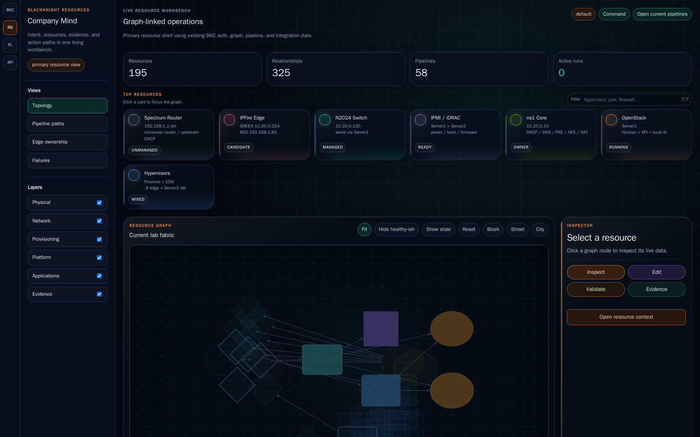
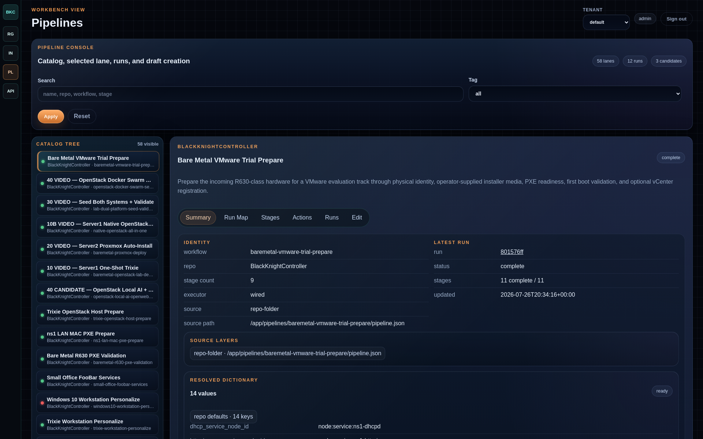
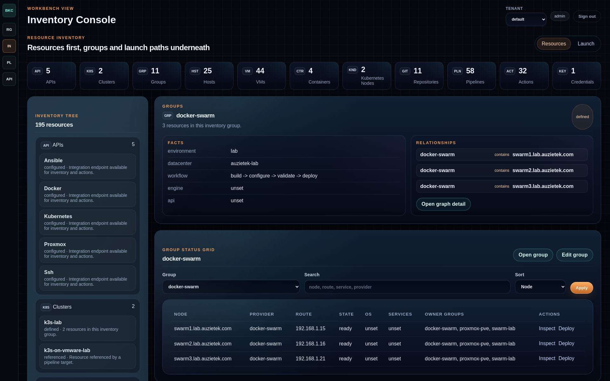
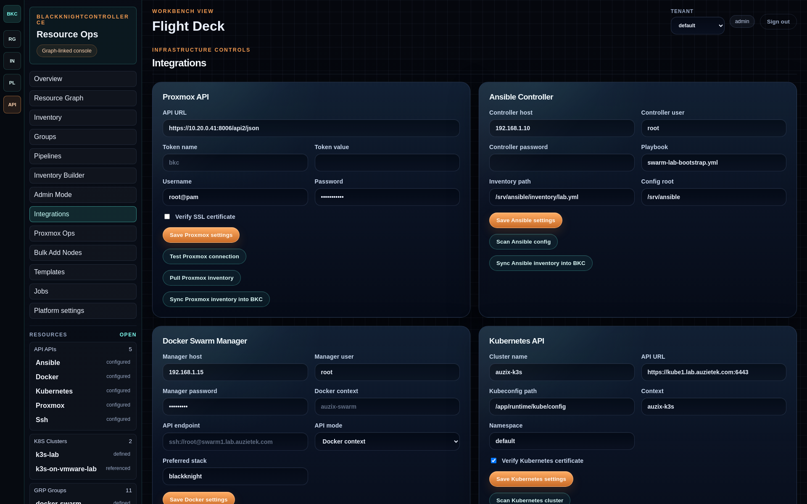

# Installing BlackKnightController

This guide covers three practical deployment tracks:

1. Docker Compose for a workstation, lab host, or small server.
2. Docker Swarm for the “BKC manages its own lab cloud” dogfood path.
3. Kubernetes for people who already have a cluster and want BKC as a normal app.

The important deployment idea is the same in all tracks:

- the BKC image contains application code;
- runtime state lives on a mounted volume;
- pipeline libraries can live on a shared/NFS path so pipeline edits do not
  require a full image rebuild.

## Runtime layout

Use one runtime directory per BKC environment:

```text
/srv/bkc/
  runtime/
    dictionaries/
    file_templates/
    keys/
    pipelines/
  source/
```

Recommended meaning:

- `source/` is a Git checkout used to build the container image.
- `runtime/dictionaries/` stores database, tenant inventory, integration
  snapshots, and runtime dictionaries.
- `runtime/file_templates/` stores operator-editable templates.
- `runtime/keys/` stores automation SSH keys and local secret material.
- `runtime/pipelines/` stores mutable pipeline folders when you want pipeline
  edits to appear without rebuilding the image.

You can keep `runtime/pipelines` on local disk or mount it from NFS.

## Clone and branch setup

Clone the repository:

```bash
sudo mkdir -p /srv/bkc
sudo chown "$USER:$USER" /srv/bkc
git clone https://github.com/auzieman/BlackKnightController-main.git /srv/bkc/source
cd /srv/bkc/source
```

Pick a local branch for your environment:

```bash
git switch main
git switch -c lab/local
```

Keep product/source changes in Git. Keep secrets, tenant data, generated
pipeline output, and local inventory under `/srv/bkc/runtime`.

## Bootstrap runtime folders

```bash
mkdir -p /srv/bkc/runtime/{dictionaries,file_templates,keys,pipelines,redis}
chmod 700 /srv/bkc/runtime/keys
```

Seed the runtime folders from the repository examples:

```bash
rsync -a --ignore-existing dictionaries/ /srv/bkc/runtime/dictionaries/
rsync -a --ignore-existing file_templates/ /srv/bkc/runtime/file_templates/
rsync -a --ignore-existing pipelines/ /srv/bkc/runtime/pipelines/
```

After this, normal pipeline edits can happen under:

```text
/srv/bkc/runtime/pipelines/
```

instead of requiring a container rebuild.

## Optional NFS pipeline library

If multiple hosts or containers should see the same pipeline library, export it
from an NFS server.

Example server path:

```text
/srv/nfs/bkc/pipelines
```

Example Linux client mount:

```bash
sudo mkdir -p /srv/bkc/runtime/pipelines
sudo mount -t nfs ns1.example.local:/srv/nfs/bkc/pipelines /srv/bkc/runtime/pipelines
```

Example `/etc/fstab` entry:

```fstab
ns1.example.local:/srv/nfs/bkc/pipelines /srv/bkc/runtime/pipelines nfs defaults,_netdev,nofail 0 0
```

Then copy the pipeline library once:

```bash
rsync -a /srv/bkc/source/pipelines/ /srv/bkc/runtime/pipelines/
```

Set `BKC_PIPELINE_FOLDERS_PATH=/app/runtime/pipelines` in the BKC web and
worker containers.

Use `BKC_PIPELINE_DEFINITIONS_PATH=/app/runtime/pipelines` when UI-edited
pipeline definitions should be written to the same runtime library.

## Windows workstation notes for NFS

For Windows users, the simplest path is usually one of these:

- run BKC inside WSL2 and mount NFS from Linux inside WSL;
- use Docker Desktop with a bind mount from a local folder;
- use SMB instead of NFS for the workstation copy, then sync to the NFS library.

WSL2 example:

```bash
sudo apt update
sudo apt install -y nfs-common
sudo mkdir -p /mnt/bkc-pipelines
sudo mount -t nfs ns1.example.local:/srv/nfs/bkc/pipelines /mnt/bkc-pipelines
```

Docker Desktop bind mounts work fine for development, but for multi-host lab
deployments an NFS-mounted runtime folder is easier to share with workers.

## Secrets

Start from the sample environment file:

```bash
cp .env.sample .env
```

Then edit `.env` for the local host. At minimum, set realistic local values for:

```dotenv
BKC_BOOTSTRAP_ADMIN_USERNAME=admin
BKC_BOOTSTRAP_ADMIN_PASSWORD=replace-me
BKC_SECRET_KEY=replace-with-output-from-openssl-rand-hex-32
```

Remove the bootstrap password from the environment after the first admin user
exists.

For automation SSH:

```bash
ssh-keygen -t ed25519 -N '' -f /srv/bkc/runtime/keys/bkc_id_ed25519
```

Install the public key on hosts BKC should manage:

```bash
ssh-copy-id -i /srv/bkc/runtime/keys/bkc_id_ed25519.pub automation@example-host
```

Do not commit `runtime/keys`, live dictionaries, API tokens, BMC passwords, or
tenant inventory.

## Track 1: Docker Compose

Create `/srv/bkc/compose.yml`:

```yaml
services:
  redis:
    image: redis:7-alpine
    restart: unless-stopped
    command: ["redis-server", "--appendonly", "yes"]
    volumes:
      - /srv/bkc/runtime/redis:/data

  bkc:
    build:
      context: /srv/bkc/source
      dockerfile: Dockerfile
    restart: unless-stopped
    ports:
      - "5000:5000"
    depends_on:
      - redis
    environment:
      BKC_SECRET_KEY: "${BKC_SECRET_KEY}"
      BKC_BOOTSTRAP_ADMIN_USERNAME: "${BKC_BOOTSTRAP_ADMIN_USERNAME:-admin}"
      BKC_BOOTSTRAP_ADMIN_PASSWORD: "${BKC_BOOTSTRAP_ADMIN_PASSWORD:-}"
      BKC_RATELIMIT_STORAGE_URI: redis://redis:6379/0
      BKC_JOB_QUEUE_URL: redis://redis:6379/2
      BKC_PIPELINE_FOLDERS_PATH: /app/runtime/pipelines
      BKC_PIPELINE_DEFINITIONS_PATH: /app/runtime/pipelines
      BKC_ACCESS_LOG_FORMAT: json
    volumes:
      - /srv/bkc/runtime/dictionaries:/app/dictionaries
      - /srv/bkc/runtime/file_templates:/app/file_templates
      - /srv/bkc/runtime/keys:/app/keys
      - /srv/bkc/runtime/pipelines:/app/runtime/pipelines

  bkc-worker:
    build:
      context: /srv/bkc/source
      dockerfile: Dockerfile
    restart: unless-stopped
    command: ["python", "bkc_worker.py"]
    depends_on:
      - redis
      - bkc
    environment:
      BKC_SECRET_KEY: "${BKC_SECRET_KEY}"
      BKC_RATELIMIT_STORAGE_URI: redis://redis:6379/0
      BKC_JOB_QUEUE_URL: redis://redis:6379/2
      BKC_PIPELINE_FOLDERS_PATH: /app/runtime/pipelines
      BKC_PIPELINE_DEFINITIONS_PATH: /app/runtime/pipelines
      BKC_ACCESS_LOG_FORMAT: json
    volumes:
      - /srv/bkc/runtime/dictionaries:/app/dictionaries
      - /srv/bkc/runtime/file_templates:/app/file_templates
      - /srv/bkc/runtime/keys:/app/keys
      - /srv/bkc/runtime/pipelines:/app/runtime/pipelines
```

Start BKC:

```bash
cd /srv/bkc
docker compose -f compose.yml up -d --build
```

Open:

```text
http://localhost:5000
```

After the first successful login, edit `/srv/bkc/compose.yml` or your `.env`
and remove `BKC_BOOTSTRAP_ADMIN_PASSWORD`.

### Updating application code

When application code changes:

```bash
cd /srv/bkc/source
git pull
cd /srv/bkc
docker compose -f compose.yml up -d --build
```

### Updating pipelines without rebuilding

When only pipeline folders change:

```bash
rsync -a /path/to/updated/pipelines/ /srv/bkc/runtime/pipelines/
```

Then refresh the BKC pipeline page. The web process reads folder-backed
pipelines from disk, so the image does not need to be rebuilt for normal
pipeline metadata/template/default changes.

Rebuild only when you change Python code, routes, static assets, container
dependencies, or executor behavior.

## Track 2: OpenStack dogfood path

This is the path to use when BKC starts managing its own move into the lab
cloud. The first hop should stay intentionally simple: provision an OpenStack
VM, create a new target-local runtime, optionally mount ns1 pipeline imports,
copy a `.env` file, and let a BKC pipeline run `docker compose up`.

This assumes:

- the OpenStack-side BKC VM can reach ns1 over the lab network;
- ns1 exports the shared BKC pipeline library or import source;
- secrets are supplied through a local `.env` file on the target VM;
- pipeline folders are mounted and refreshed separately from the image.

On ns1, keep the shared import library in one predictable place:

```bash
sudo mkdir -p /srv/nfs/bkc/runtime/pipelines
```

On the OpenStack-side BKC VM, create a native runtime and mount the import
library as a second read-only folder:

```bash
sudo mkdir -p /srv/bkc/runtime/{dictionaries,file_templates,keys,pipelines,redis}
sudo mkdir -p /srv/bkc/imports/pipelines
sudo mount -t nfs -o ro ns1.example.local:/srv/nfs/bkc/runtime/pipelines /srv/bkc/imports/pipelines
```

Example `/etc/fstab` entry on the OpenStack VM:

```fstab
ns1.example.local:/srv/nfs/bkc/runtime/pipelines /srv/bkc/imports/pipelines nfs defaults,_netdev,nofail,ro 0 0
```

Clone or update the source checkout on the OpenStack VM:

```bash
sudo mkdir -p /srv/bkc
sudo chown "$USER:$USER" /srv/bkc
git clone https://github.com/auzieman/BlackKnightController-main.git /srv/bkc/source
cd /srv/bkc/source
git switch main
```

Create `/srv/bkc/.env` on the target VM from the repository sample. This file
is the pragmatic first secrets boundary for the lab. Keep it out of Git and
treat it as local machine state:

```bash
cp /srv/bkc/source/.env.sample /srv/bkc/.env
chmod 0600 /srv/bkc/.env
${EDITOR:-vi} /srv/bkc/.env
```

Create `/srv/bkc/compose.yml`:

```yaml
services:
  redis:
    image: redis:7-alpine
    restart: unless-stopped
    command: ["redis-server", "--appendonly", "yes"]
    volumes:
      - /srv/bkc/runtime/redis:/data

  bkc:
    build:
      context: /srv/bkc/source
      dockerfile: Dockerfile
    restart: unless-stopped
    ports:
      - "5000:5000"
    env_file:
      - /srv/bkc/.env
    depends_on:
      - redis
    volumes:
      - /srv/bkc/runtime/dictionaries:/app/dictionaries
      - /srv/bkc/runtime/file_templates:/app/file_templates
      - /srv/bkc/runtime/keys:/app/keys
      - /srv/bkc/runtime/pipelines:/app/runtime/pipelines
      - /srv/bkc/imports/pipelines:/app/imports/pipelines:ro

  bkc-worker:
    build:
      context: /srv/bkc/source
      dockerfile: Dockerfile
    restart: unless-stopped
    command: ["python", "bkc_worker.py"]
    env_file:
      - /srv/bkc/.env
    depends_on:
      - redis
      - bkc
    volumes:
      - /srv/bkc/runtime/dictionaries:/app/dictionaries
      - /srv/bkc/runtime/file_templates:/app/file_templates
      - /srv/bkc/runtime/keys:/app/keys
      - /srv/bkc/runtime/pipelines:/app/runtime/pipelines
      - /srv/bkc/imports/pipelines:/app/imports/pipelines:ro
```

The dogfood pipeline should perform these steps over SSH on the target VM:

```bash
sudo mkdir -p /srv/bkc/runtime/{dictionaries,file_templates,keys,pipelines,redis}
sudo mkdir -p /srv/bkc/imports/pipelines
sudo mountpoint -q /srv/bkc/imports/pipelines || sudo mount /srv/bkc/imports/pipelines
cd /srv/bkc/source
git fetch --all --prune
git switch main
git pull --ff-only
cd /srv/bkc
docker compose --env-file /srv/bkc/.env -f /srv/bkc/compose.yml up -d --build
docker compose -f /srv/bkc/compose.yml ps
```

After the first admin account exists, remove `BKC_BOOTSTRAP_ADMIN_PASSWORD`
from `/srv/bkc/.env` and redeploy.

This is also the path to automate with BKC itself: render `.env` from a secret
fragment, render `compose.yml` from a known-good template, ship both to the
OpenStack VM, scan import sources, mount ns1 imports, run Compose, then
validate `/ready` and the edge route.

### Later: Swarm expansion

Once the OpenStack-side single-VM deployment is solid, the same runtime layout
can graduate to a Docker Swarm. At that point, worker nodes should mount the
same BKC native runtime/import paths, and the BKC image should come from a
registry instead of being built locally on each node.

The Swarm version should keep the same separation:

- image: application code;
- native runtime mount: dictionaries, templates, keys, pipelines, Redis data;
- import mount: shared pipeline/source library, usually read-only;
- `.env` or future Docker secrets: deployment-specific secrets.

For Swarm, place the BKC web and worker services on worker nodes unless you
explicitly want the control-plane managers to run application containers:

```yaml
deploy:
  placement:
    constraints:
      - node.role == worker
```

Docker secrets are the better long-term shape, but the current app expects
direct environment variables. If you want to use Docker secrets before native
`*_FILE` support lands, add a small entrypoint wrapper that reads
`/run/secrets/...`, exports `BKC_SECRET_KEY` and
`BKC_BOOTSTRAP_ADMIN_PASSWORD`, then starts `python bkc_server.py` or
`python bkc_worker.py`.

This is the pattern BKC should use when it eventually manages its own move into
an OpenStack-hosted Docker environment: provision the VM or swarm, mount the
runtime/NFS library, deploy BKC, validate routes, then let BKC manage the next
layer.

## Track 3: Kubernetes

This is a minimal Kubernetes shape. Production clusters should adapt storage,
ingress, secrets, and resource requests to their environment.

Create a namespace:

```bash
kubectl create namespace bkc
```

Create secrets:

```bash
kubectl -n bkc create secret generic bkc-app-secret \
  --from-literal=BKC_SECRET_KEY="$(openssl rand -hex 32)" \
  --from-literal=BKC_BOOTSTRAP_ADMIN_USERNAME=admin \
  --from-literal=BKC_BOOTSTRAP_ADMIN_PASSWORD='replace-me'
```

Create an NFS-backed persistent volume for runtime state. Adjust the server and
path:

```yaml
apiVersion: v1
kind: PersistentVolume
metadata:
  name: bkc-runtime-nfs
spec:
  capacity:
    storage: 20Gi
  accessModes: ["ReadWriteMany"]
  persistentVolumeReclaimPolicy: Retain
  nfs:
    server: ns1.example.local
    path: /srv/nfs/bkc/runtime
---
apiVersion: v1
kind: PersistentVolumeClaim
metadata:
  name: bkc-runtime
  namespace: bkc
spec:
  accessModes: ["ReadWriteMany"]
  resources:
    requests:
      storage: 20Gi
  volumeName: bkc-runtime-nfs
```

Deploy Redis:

```yaml
apiVersion: apps/v1
kind: Deployment
metadata:
  name: redis
  namespace: bkc
spec:
  replicas: 1
  selector:
    matchLabels: { app: redis }
  template:
    metadata:
      labels: { app: redis }
    spec:
      containers:
        - name: redis
          image: redis:7-alpine
          args: ["redis-server", "--appendonly", "yes"]
---
apiVersion: v1
kind: Service
metadata:
  name: redis
  namespace: bkc
spec:
  selector: { app: redis }
  ports:
    - port: 6379
```

Deploy BKC web and worker. Replace the image name with your registry/image:

```yaml
apiVersion: apps/v1
kind: Deployment
metadata:
  name: bkc
  namespace: bkc
spec:
  replicas: 1
  selector:
    matchLabels: { app: bkc }
  template:
    metadata:
      labels: { app: bkc }
    spec:
      containers:
        - name: bkc
          image: ghcr.io/example/blackknightcontroller:latest
          ports:
            - containerPort: 5000
          envFrom:
            - secretRef:
                name: bkc-app-secret
          env:
            - name: BKC_RATELIMIT_STORAGE_URI
              value: redis://redis:6379/0
            - name: BKC_JOB_QUEUE_URL
              value: redis://redis:6379/2
            - name: BKC_PIPELINE_FOLDERS_PATH
              value: /app/runtime/pipelines
            - name: BKC_PIPELINE_DEFINITIONS_PATH
              value: /app/runtime/pipelines
          volumeMounts:
            - name: runtime
              mountPath: /app/runtime
            - name: runtime
              mountPath: /app/dictionaries
              subPath: dictionaries
            - name: runtime
              mountPath: /app/file_templates
              subPath: file_templates
            - name: runtime
              mountPath: /app/keys
              subPath: keys
      volumes:
        - name: runtime
          persistentVolumeClaim:
            claimName: bkc-runtime
---
apiVersion: apps/v1
kind: Deployment
metadata:
  name: bkc-worker
  namespace: bkc
spec:
  replicas: 1
  selector:
    matchLabels: { app: bkc-worker }
  template:
    metadata:
      labels: { app: bkc-worker }
    spec:
      containers:
        - name: bkc-worker
          image: ghcr.io/example/blackknightcontroller:latest
          command: ["python", "bkc_worker.py"]
          envFrom:
            - secretRef:
                name: bkc-app-secret
          env:
            - name: BKC_RATELIMIT_STORAGE_URI
              value: redis://redis:6379/0
            - name: BKC_JOB_QUEUE_URL
              value: redis://redis:6379/2
            - name: BKC_PIPELINE_FOLDERS_PATH
              value: /app/runtime/pipelines
            - name: BKC_PIPELINE_DEFINITIONS_PATH
              value: /app/runtime/pipelines
          volumeMounts:
            - name: runtime
              mountPath: /app/runtime
            - name: runtime
              mountPath: /app/dictionaries
              subPath: dictionaries
            - name: runtime
              mountPath: /app/file_templates
              subPath: file_templates
            - name: runtime
              mountPath: /app/keys
              subPath: keys
      volumes:
        - name: runtime
          persistentVolumeClaim:
            claimName: bkc-runtime
---
apiVersion: v1
kind: Service
metadata:
  name: bkc
  namespace: bkc
spec:
  selector: { app: bkc }
  ports:
    - port: 5000
      targetPort: 5000
```

Expose the service with your ingress controller, or port-forward for a first
test:

```bash
kubectl -n bkc port-forward svc/bkc 5000:5000
```

Then open:

```text
http://localhost:5000
```

After first login, remove the bootstrap password from the Kubernetes secret:

```bash
kubectl -n bkc delete secret bkc-app-secret
kubectl -n bkc create secret generic bkc-app-secret \
  --from-literal=BKC_SECRET_KEY='<existing-secret-key>' \
  --from-literal=BKC_BOOTSTRAP_ADMIN_USERNAME=admin
kubectl -n bkc rollout restart deploy/bkc deploy/bkc-worker
```

## Readiness checks

Check the public readiness endpoint:

```bash
curl -fsS http://localhost:5000/ready
```

Check the API health endpoint:

```bash
curl -fsS http://localhost:5000/api/v1/health
```

For route smoke testing after install or upgrade:

```bash
./tools/site_smoke.py --base-url http://localhost:5000 --max-pages 25
```

## Visual validation

After BKC is running, the first useful check is visual: can you see resources,
pipelines, inventory, and integrations as connected operator surfaces?



The resource workbench should show live resource counts, relationship counts,
pipeline counts, top resources, and the graph-linked workspace.



The pipeline workbench should show the catalog, selected pipeline metadata,
latest run state, resolved dictionary values, stages, actions, and run history.



The inventory console should show discovered resources by kind, linked groups,
facts, relationships, and launch paths.



The integrations page should expose the configured API/SSH/controller paths that
BKC can use to refresh inventory and run actions.

When you want documentation images from a live BKC instance, use the capture
tool. This keeps README images, video decks, and site proof aligned with a real
running environment:

```bash
export BKC_CAPTURE_USERNAME=admin
export BKC_CAPTURE_PASSWORD='<your-admin-password>'

docker --context default run --rm \
  --network host \
  -v "$PWD:/work" \
  -w /work \
  mcr.microsoft.com/playwright/python:v1.45.0-jammy \
  sh -lc 'python -m pip install -q playwright==1.45.0 && python tools/capture_bkc_views.py --base-url http://127.0.0.1:5000'
```

For a remote lab URL, replace `--base-url` with the reachable BKC address. The
manifest lives in [docs/bkc-view-captures.json](docs/bkc-view-captures.json),
and the generated PNGs land in `docs/images/generated/`.

## What requires a rebuild?

Usually requires rebuild/redeploy:

- Python application code
- routes, services, workers, API behavior
- JavaScript/CSS/templates
- dependency changes
- Dockerfile changes

Usually does not require rebuild:

- pipeline JSON folders mounted through `BKC_PIPELINE_FOLDERS_PATH`
- UI-edited pipeline definitions mounted through `BKC_PIPELINE_DEFINITIONS_PATH`
- runtime dictionaries
- tenant inventory snapshots
- operator templates mounted from `file_templates`
- keys and external credential files

This boundary is what lets BKC act more like a control plane than a static demo
image. Keep the app image boring and reproducible; keep the lab library mounted
and refreshable.
